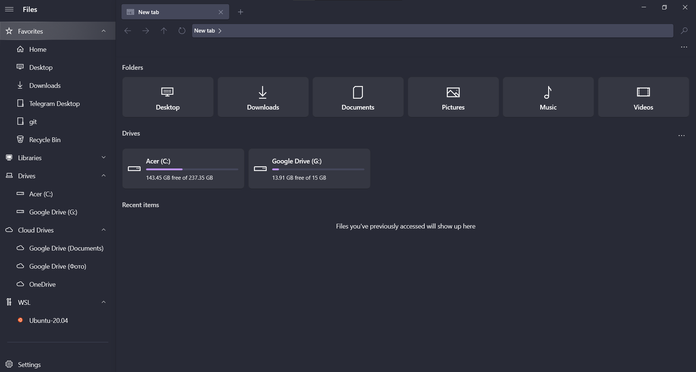

# Dracula for [Files](https://github.com/files-community/Files)

> A dark theme for [Files](https://github.com/files-community/Files).

## Install

All instructions can be found at [draculatheme.com/files](https://draculatheme.com/files).

## Team

This theme is maintained by the following person(s) and a bunch of [awesome contributors](https://github.com/dracula/template/graphs/contributors).

 |
--- |
[Adil Akhmetov](https://github.com/weeebdev) |

## License

[MIT License](./LICENSE)
